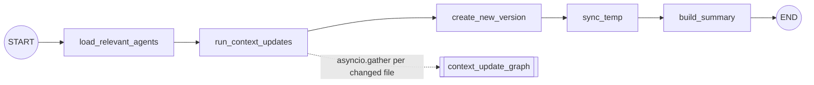
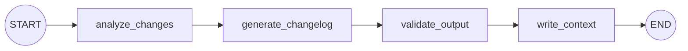
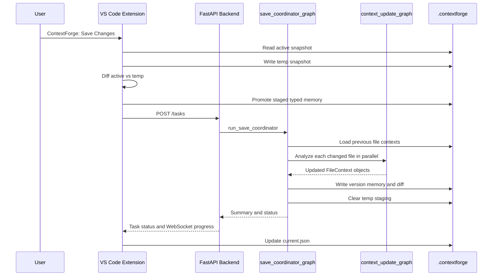

[](https://github.com/DIMAX99/cf/stargazers)
[](https://github.com/DIMAX99/cf/network/members)

Context Forge is a VS Code extension and FastAPI backend that turns a project into a versioned, AI-readable memory system. It tracks snapshots, folder ownership, agent boundaries, file contracts, changelog intent, and richer code intelligence so coding agents can work from structured context instead of repeatedly rediscovering the repository.

The current implementation is split into:

- a TypeScript VS Code extension in `src/`
- a Python FastAPI backend in `apps/backend/`
- LangGraph workflows for save orchestration and per-file context analysis
- a `.contextforge/` project memory layout with `temp/` staging and saved versions like `v1`, `v2`, and `v3`

## Schema Overview

The current schema redesign is included below.

<p align="center">
  
</p>

## What It Does

Context Forge lets a project keep durable memory about itself:

- initializes `.contextforge/` with project metadata and typed staging folders
- creates tracked folders and assigns them to agents
- creates tracked files with file-level context JSON
- creates reusable project agents with responsibilities and technical scope
- snapshots the workspace and computes added, removed, and modified files
- saves each change set as a new version
- sends changed file contents to the backend for LLM-based context enrichment
- writes rich `FileContext` records with contracts, imports, side effects, data flow, risks, complexity, and change reasons

## LangGraph Workflows

The backend currently has two compiled LangGraph graphs.

### Save Coordinator Graph

`apps/backend/agents/save_coordinator.py` owns the outer save workflow. It loads previous context, runs file updates in parallel, creates the new memory version, clears staging, and returns a user-facing summary.



Nodes:

- `load_relevant_agents`: reads prior `FileContext` records from the previous version.
- `run_context_updates`: invokes `run_context_update(...)` once per changed file using `asyncio.gather`.
- `create_new_version`: creates `.contextforge/{version}`, copies typed memory, writes analyzed file contexts, snapshot, and `diff.json`.
- `sync_temp`: clears `.contextforge/temp` and recreates staging directories.
- `build_summary`: builds save statistics and status for the frontend.

### Context Update Agent Graph

`apps/backend/agents/context_update_agent.py` owns the per-file intelligence pass. It analyzes one changed file and returns an updated `FileContext`.



Nodes:

- `analyze_changes`: calls Gemini through `ChatGoogleGenerativeAI` with structured `AnalysisResult` output.
- `generate_changelog`: produces a structured changelog entry focused on what changed and why.
- `validate_output`: converts analysis into the rich Pydantic `FileContext` schema.
- `write_context`: currently a no-op hook because persistence is handled by `save_coordinator`.

## End-to-End Save Flow



## Repository Map

```text
.
|-- src/
|   |-- commands/              # VS Code commands: init, create folder/file/agent, save
|   |-- core/                  # ContextForge state manager
|   |-- services/              # snapshots, diffs, backend calls, filesystem helpers
|   `-- utils/                 # templates, typed paths, shared TS types
|-- apps/backend/
|   |-- api/server.py          # FastAPI app, task API, WebSocket progress
|   |-- agents/                # LangGraph workflows
|   |-- memory/                # context loading and writing
|   |-- schemas/context.py     # rich Pydantic context schema
|   `-- main.py                # uvicorn entrypoint
`-- context_forge_schema_redesign.svg
```

## Memory Layout

After initialization, each workspace gets a `.contextforge/` directory.

```text
.contextforge/
|-- current.json
|-- temp/
|   |-- global.json
|   |-- changelog.json
|   |-- snapshot.json
|   |-- folders/
|   |-- files/
|   `-- agents/
`-- vN/
    |-- global.json
    |-- meta.json
    |-- snapshot.json
    |-- diff.json
    |-- folders/
    |-- files/
    `-- agents/
```

File and folder context filenames use URL-safe base64 path encoding to avoid collisions.

## Backend API

The backend exposes:

- `GET /health`: health check.
- `POST /context/load`: load merged project context.
- `POST /context/update`: write file, folder, agent, or commit context.
- `POST /tasks`: create a background save task.
- `GET /tasks/{task_id}`: poll save task status.
- `WS /ws/tasks/{task_id}`: stream save progress.

Authenticated HTTP routes expect `X-API-Key`. The WebSocket endpoint expects `?api_key=...`.

## Local Development

Install extension dependencies:

```powershell
npm install
npm run compile
```

Run the backend:

```powershell
cd apps/backend
python -m venv .venv
.\.venv\Scripts\Activate.ps1
pip install -r requirements.txt
$env:GOOGLE_API_KEY="your-google-api-key"
$env:CF_API_KEY="EWvril6fTbdIJNaVcvgraOK8bT3qBgJ7"
$env:PORT="3000"
python main.py
```

The VS Code setting `contextforge.backendUrl` defaults to `http://localhost:3000`. If you do not set `PORT`, the backend defaults to `8000`, so update the extension setting to `http://localhost:8000`.

## Extension Commands

- `ContextForge: Init CF`
- `ContextForge: Create Folder`
- `ContextForge: Create File`
- `ContextForge: Create Agent`
- `ContextForge: Save Changes`
- `ContextForge: Refresh Version History`

## Current Notes

- The save coordinator writes enriched file contexts to the new version under `files/`.
- The context update graph keeps `write_context` as a future hook, but persistence currently happens in `create_new_version`.
- Removed files are included in the save diff, but per-file analysis receives an empty new-code payload for deleted content only if the frontend sends that path through the changed-file list.
- The backend uses Gemini through `langchain_google_genai`, so `GOOGLE_API_KEY` is required for real analysis.

## License

MIT
